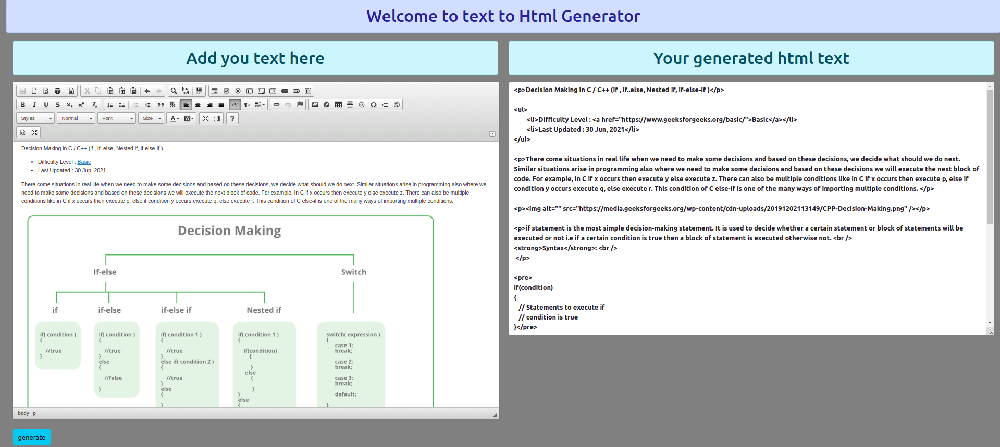

# Installation Setup
  - ### Create a virutal environment for the project and activate it
    -  #### Windows refer this -- > [windows setup](https://www.stanleyulili.com/django/how-to-install-django-on-windows/)
    - #### Ubuntu refer this ----> [ubutnut setup](https://www.javatpoint.com/django-virtual-environment-setup)
    - #### Mac refer this -------> [mac users setup](https://appdividend.com/2018/03/28/how-to-install-django-in-mac/)
  - You can create a folder for the project can direclty the repo using these `git clone https://github.com/satyam4484/Text_to_html.git` .
  - install required dependies for the project using  ` pip install -r requirements.txt`.
  - make you are in the folder where the file python manage.py exists , then run the command `python manage.py runserver ` to start the server , click the link and you will be redirected to webpage of the project .
  - It uses django-ckeditor do refer its documentation [link1](https://pypi.org/project/django-ckeditor/),[link2](https://ckeditor.com/ckeditor-4/)

___
# Project images 

# Contributions
  - Pull requests are welcome. For major changes, please open an issue first to discuss what you would like to change.

